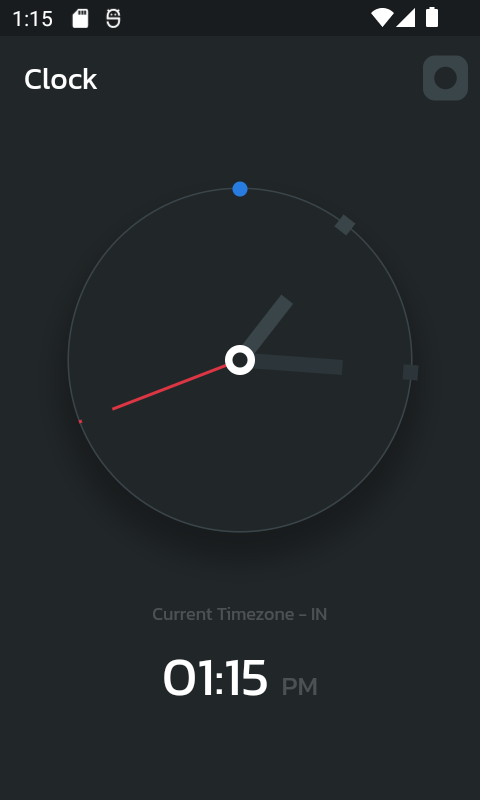
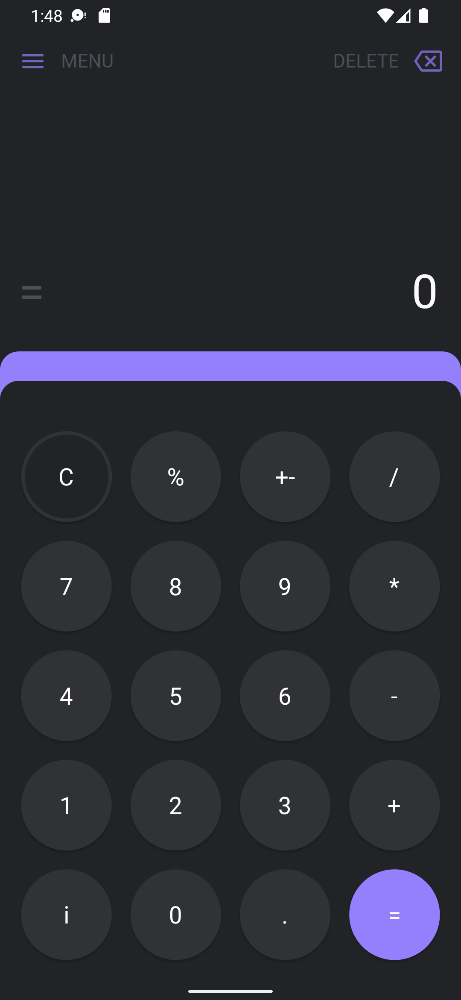

- ## CodeHeck

🎨 A short coding live serie about UI prototypes from Figma and Dribble

This serie in a nutshell:

- Code-Challenges
- A Lot of Bugs
- Full Mobile
- Dev Rage Noises
- Noice Learning Curve

Also, if you want, you can join us, just login to our [Discord Server](https://discord.gg/Ay3SpX6kTa)

We can change anything about the lives, the main aim is just to have fun, build some stuff and learn new things.

- ## Killua

 
 
  

  

    Final result
  

  
  

  

    Prototype
  

  

- **CodeHeck #0**
- Time: **4h**
- Live: **[available in PT-BR](https://www.youtube.com/watch?v=uo37jLj7Qgo&t=3518s)**
- Design: **[Available on Dribble](https://dribbble.com/shots/7477712-Minimalist-Clock-App-UI-Kit)**
- _Hunter X Hunter_

- ## Shinoa

 
 

  

    Final result
  

  
  

- ## Who is behind the bugs?

<table>
  <tr>
    <td align="center">
      <a href="https://github.com/luanbatistadev">
         
       <b>Luan Batista</b>
      </a>
    </td>
    <td align="center">
      <a href="https://github.com/alexrintt">
         
       <b>Alex Rintt</b>
      </a>
    </td>
  </tr>
</table>
