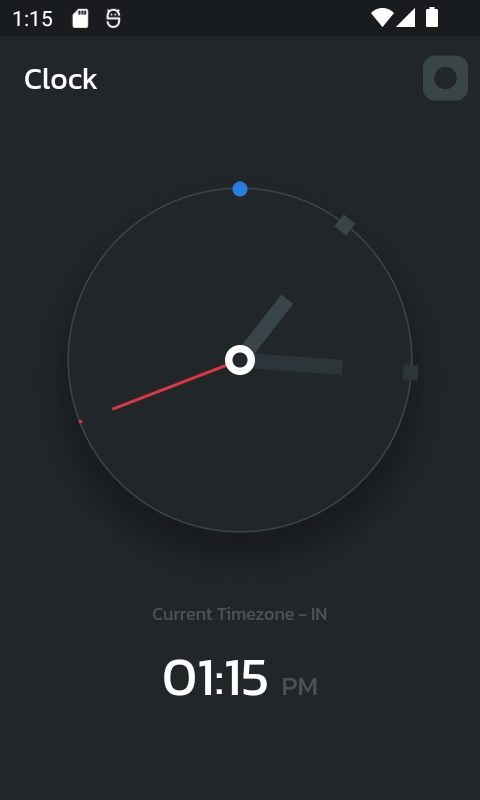
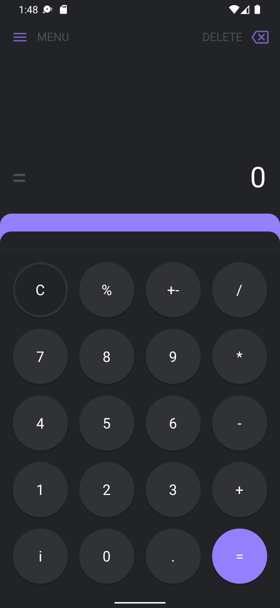

- ## CodeHeck

🎨 Uma pequena série de vídeos no Youtube codando alguns protótipos do Figma e do Dribble.

Em resumo, essa série terá bastante:

- Code-Challenges
- Muitos Bugs
- Bastante Mobile
- Bastante Rage
- Aprendizado

Se quiser participar das lives que vão ocorrer todo final de semana, [só colar no Discord.](https://discord.gg/Ay3SpX6kTa)

As lives podem mudar de foco, de conteúdo. A intenção é se divertir, construir alguns projetos e aprender.

- ## Killua

 
 
  

  

    Resultado final
  

  
  

  

    Protótipo
  

  

- **CodeHeck #0**
- Tempo: **4 horas**
- Live: **[disponível](https://www.youtube.com/watch?v=uo37jLj7Qgo&t=3518s)**
- Design: **[Disponível no Dribble](https://dribbble.com/shots/7477712-Minimalist-Clock-App-UI-Kit)**
- _Hunter X Hunter_

- ## Shinoa

 
 

  

    Resultado final
  

  
  

- ## Quem que tá on fire?

<table>
  <tr>
    <td align="center">
      <a href="https://github.com/luanbatistadev">
         
       <b>Luan Batista</b>
      </a>
    </td>
    <td align="center">
      <a href="https://github.com/alexrintt">
         
       <b>AlexRintt</b>
      </a>
    </td>
  </tr>
</table>
